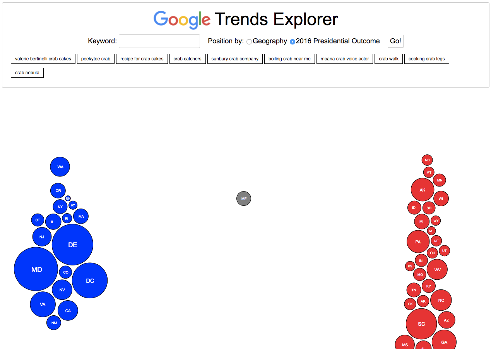

# Google Trends Explorer

[Live Link](http://google-trends-explorer.herokuapp.com/)

## Background

The __Google Trends Explorer__ is an interactive interface for exploring Google search queries by location and time.

## Technology

This application utilizes a [Google trends API](https://www.npmjs.com/package/google-trends-api) made available by npm, which provides four methods:

* interestOverTime
* interestByRegion
* relatedQueries
* relatedTopics

It uses JavaScript to format the data and the D3 data visualization library to render it.

