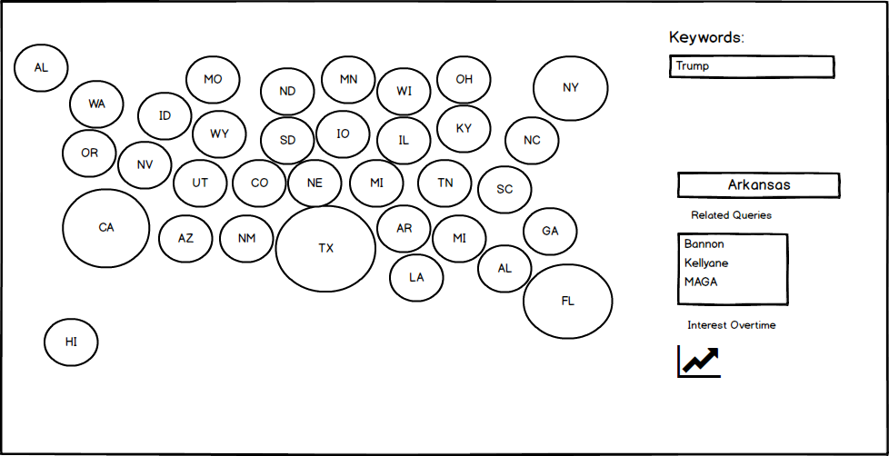

# Google Trends Explorer

## Background

The __Google Trends Explorer__ is an interactive interface for exploring Google search queries by location and time.

## Technology

This application will utilize the Google Trends publicly available API, which has four methods:

* interestOverTime
* interestByRegion
* relatedQueries
* relatedTopics

It will use JavaScript to format the data and the D3 data visualization library to render it.

## MVPs

Users will be able to:

- [ ] See a map of the United States, with states as bubbles, each sized by geographic size
- [ ] Type a keyword or multiple keywords in input one or multiple checkboxes and hit enter
- [ ] See the bubbles resize to the proportions to which they have an interest in the keywords entered
- [ ] Click on a bubble and see that state's related queries for the entered keyword(s)
- [ ] Click on a related query to re-render the visualization with that query as the keyword

## User Experience

In addition, this interface will have instructions for how to navigate the various controls, as well as a README explaining the technology behind it.

## Implementation Timeline

### Day One: Layout and Visuals

- [ ] Users can see a bubble for each state with a state abbreviation label and size based on geographic area
- [ ] There is an input text field

### Day Two: API Requests

- [ ] The program responds to user input by submitting appropriate API requests
- [ ] The data is received and stored in an organized manner

### Day Three: Re-rendering Visuals
- [ ] The visuals respond to the data once it is received

## Wireframes

## Bonus Features

Users will be able to:

- [ ] See a line graph
- [ ] Click on a bubble to see that state's interest in that topic overtime rendered on the line graph

